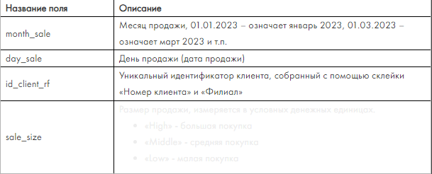
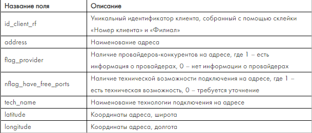
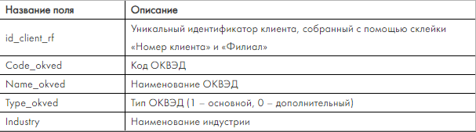
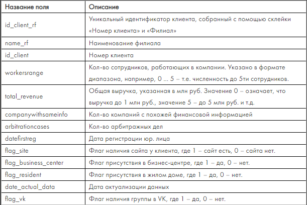
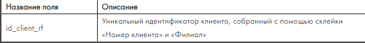
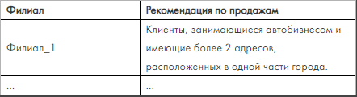
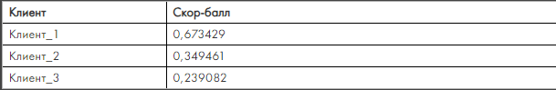

### Общее описание задачи

В рамках текущего хакатона решается фактическая задача, с которой сталкивается бизнес-подразделение компании Ростелеком. **Основная цель** подразделения B2B – **привлечение 100 тыс. новых клиентов** каждый год. В рамках данной цели рассматривается вопрос создания модели, позволяющей определить наиболее склонных к подключению клиентов.

**Предметная область**: продажи потенциальным (новым) клиентам B2B Ростелеком. Потенциальный (новый) клиент – клиент, у которого нет действующих подключенных услуг от Ростелекома.

**Цель**: предложение бизнес-подразделению Ростелекома инструмента, позволяющего повысить эффективность процесса по привлечению новых клиентов.

**Механика**: используя информацию по уже совершенным продажам, спрогнозировать по новым клиентам кто больше всего склонен к потенциальной покупке.

Для достижения цели, необходимо выполнить **следующие задачи**:

- Провести первичный анализ полученных данных. Создать модель данных, позволяющую объединить исходные данные, с использованием различных доступных инструментов и видов соединений таблиц
- Проверить данные на валидность, провести этап предобработки
- Провести аналитику данных, с помощью различных доступных инструментов анализа
- Сформировать итоговые выводы с последующей визуализацией.

В результате, мы ожидаем получить **следующую информацию**:

1. Рекомендации по каждому из филиалов по будущим продажам
2. Разметка по потенциальным клиентам, с указанием score-балла (или вероятности последующей покупки)
Пункт 1 необходимо реализовать с помощью визуализации в любом удобном инструменте. 
Пункт 2 необходимо предоставить в формате csv с указанием score-балла по каждому из клиентов.

В данном вопросе вам предоставляется доступ к Gitlab: https://git.codenrock.com/
В следующем вопросе будут подробнее расписаны задачи, а также будет возможность загрузить файлы с решением.

Вам будут предоставлены 5 excel файлов, в каждом из которых будет информация по клиентам. В некоторых из них могут встречаться проблемы с заполнением значений по столбцам – самостоятельно принимайте решение об использовании этих данных или нет. 

Ссылка на файлы: https://disk.yandex.ru/d/vz2xiO-iXgU8OQ

Краткое содержание каждого из файлов:

- «sales.xls» – данные по уже совершенным продажам за прошлые периоды
- «base_info_client.csv» – данные по всем клиентам, базовая информация
- «okved_industry_client.csv» – информация по сфере деятельности клиентов (в т.ч. ОКВЭД)
- «address_client.csv» – информация по адресам потенциальных клиентов
- «final_list.csv» – список клиентов, которым необходимо проставить score-балл.

В каждом из файлов есть следующий ключ – id_client_rf(клиент_филиал). По данному полю необходимо связывать все 5 таблиц. Обратите внимание, что не все клиенты могут найтись сразу во всех таблицах.

Подробное описание каждой из таблиц:

**Данные по продажам - sales.xls**
В данном файле содержится информация по продажам за период Январь-Июль 2023г. В витрина ключевым значением является идентификатор клиента + день продажи, т.е. если клиент оформлял покупки в разные дни, то это будет несколько строк в данных. Обратите внимание, что размер этих покупок может быть, как одинаковым, так и разным.

 

**Данные по адресам клиентов - address_client.csv**
В данном файле содержится информация по адресам клиентов. Обратите внимание, что по каждому адресу есть дополнительная информация о наличии технической возможности и наименовании технологии подключения. Используйте для более точного прогнозирования.  У одного клиента может быть несколько адресов.

 

**Данные по сфере деятельности - okved_industry_client.csv**
В данном файле содержится информация по сферам деятельности клиентов. Обратите внимание, что есть указание ОКВЭД (более подробно можно изучить по ссылке: https://www.consultant.ru/document/cons_doc_LAW_163320/), признак «основной-не основной» (у клиента может быть несколько видов деятельности, но обязательно есть указание об основной). Поле индустрия – это некий мэппинг кодов ОКВЭД. Данная информация поможет вам сформировать рекомендации по регионам, а также обогатить модель скоринга.

 

**Данные по клиентам - base_info_client.csv**
Базовая информация по клиентам. Некоторые признаки реализованы в булевом формате, где 1 – да/присутствует, 0 – нет/не присутствует.

 

**Список клиентов для скоринга - final_list.csv**
Список клиентов, по кому ожидаем увидеть разметку склонности к покупке.

 

В рамках реализации задачи, вы можете использовать любые внешние данные, которые могут помочь повысить качество прогнозирования и улучшить совокупный эффект модели. Если такие данные будут использоваться, в ходе презентации необходимо про них дополнительно рассказать.
 

**Рекомендации к решению со стороны бизнеса.**

Есть ряд рекомендаций, которые могут помочь вам в решении данной задачи и\или улучшении качества полученного результата (использовать их или нет – остается на ваше усмотрение).

Каждый филиал может принципиально отличаться от другого. Формировать рекомендации необходимо в разрезе филиалов - name_rf
Продажи по объему (в кол-во проданных услуг, в деньгах) могут быть разные. Иногда важнее привлечь одного клиента с чеком 10000 руб., чем трех клиентов с чеком по 2000 руб. Используйте соответствующее поле по продажам
Не всегда основной ОКВЭД отражает реальную деятельность клиента, рассмотрите все возможные ОКВЭД. Изучите распределение и наиболее популярные ОКВЭД.
Вероятность подключить клиента в соседнее здание к уже подключенному клиенту – сильно выше. Используйте расстояние не более 50 метров.
Вероятность подключить клиента, если в здании есть оптика (стек технологий %PON, FTT%, ETT%) выше, чем на меди.
 
**Формат предоставляемого решения.**

Успешным окончанием проекта является предоставление следующей информации.

В формате docx необходимо указать, что было сделано в рамках проекта, а именно:
- Предобработка данных, с подробным описанием что было сделано и зачем.
- Как вы решали задачу (с помощью каких инструментов, библиотек, алгоритмов и т.п.)
- Скриншот собранной модели данных с указанием связей (в произвольном виде или указания части кода соединения таблиц по ключевым полям)
- Код программы, запросов, алгоритмов, использованных для решения данной задачи. 
- Информация об использовании внешних данных (источники, признаки, причина добавления этой информации в модели)
- Рекомендация по каждому из филиалов по будущим продажам (какой сегмент клиентов в будущих периодах будет больше всего генерировать продажи).

Также возможно использования визуализации топ-признаков и их значений по каждому из филиалов. 

С помощью визуализации можно показать, как признаки отличаются между собой, а также показать какие признаки чаще всего попадают в топ-список среди всех филиалов

 

В формате csv необходимо указать разметку по потенциальным клиентам, с указанием score-балла (или вероятности последующей покупки)

Score-балл – может быть результатом модели машинного обучения, так и синтетически сгенерированный в рамках данной задачи, должен быть нормирован в диапазоне от 0 до 1. Важно, чтобы этот показатель мог помочь в сравнении клиентов и определении наиболее и наименее склонных клиентов.

*В качестве ответа вам необходимо объединить файлы в один архив и загрузить архив в этот вопрос (в окно справа). *

Критерии оценки:
- Выстраивание модели данных 
- Применены внешние данные 
- Составлен список рекомендаций по филиалам 
- Выполнена задача по разметке клиентов с указанием score 
- Выполнена визуализация полученных выводов 
- Проведение презентации решения